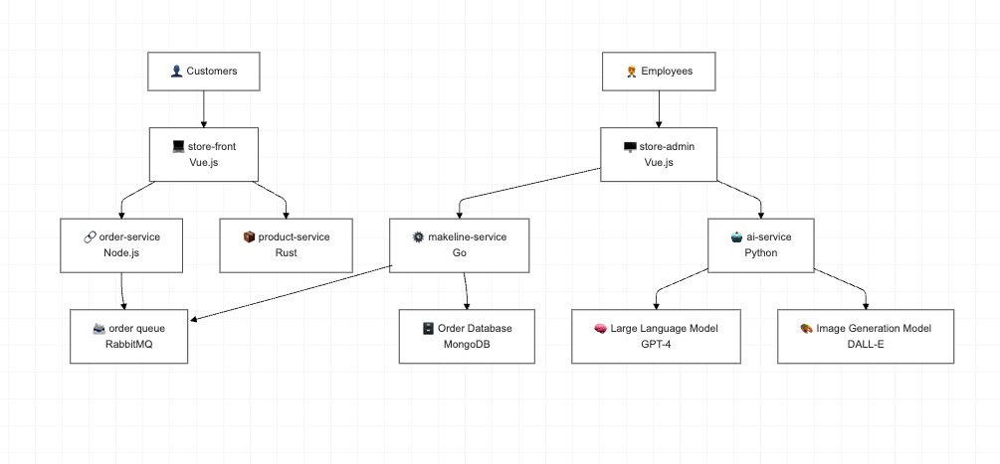

# Best Buy Cloud-Native App

## Table of Contents
- [Application Overview](#application-overview)
- [Updated Architecture Diagram](#updated-architecture-diagram)
- [Application and Architecture Explanation](#application-and-architecture-explanation)
- [Deployment Instructions](#deployment-instructions)
- [Microservice Repositories](#microservice-repositories)
- [Docker Images](#docker-images)
- [Demo Video](#demo-video)
- [Issues and Limitations](#issues-and-limitations)

---

## 1. Application Overview
This cloud-native application is designed to demonstrate a scalable and AI-integrated solution for Best Buy's online store. The application is built using a microservices architecture, deployed in a Kubernetes cluster, and features AI-powered product descriptions and image generation using GPT-4 and DALL-E.

### 2.Components:
- **Store-Front**: Customer-facing web app for browsing products and placing orders.
- **Store-Admin**: Employee-facing admin app for managing product data and viewing orders.
- **Order-Service**: Handles order creation and sends order data to the managed queue (Azure Service Bus).
- **Product-Service**: CRUD operations for product data.
- **Makeline-Service**: Processes orders by consuming messages from the queue.
- **AI-Service**: AI-generated product descriptions and images using GPT-4 and DALL-E.
- **Database**: MongoDB for storing order and product data.


---
## 3. Application and Architecture Explanation

The application follows a microservices-based architecture, with each service handling a specific business functionality. The services communicate via HTTP, and MongoDB is used for storing product and order information. Kubernetes manages the deployment, scaling, and configuration of all services.
## Architecture




## 4.Deployment Instructions
Follow these steps to deploy the application in a Kubernetes cluster:

1. Clone all microservice repositories:
   ```bash
   git clone https://github.com/Serpil-Dndr/best-buy-cloud-native-app.git

   ```

## 5.Table of Microservice Repositories:

The application has the following services: 
| Service                  | Description                                    | GitHub Repo                                                                                      |
|--------------------------|------------------------------------------------|--------------------------------------------------------------------------------------------------|
| `store-front-bestbuy`    | Web app for customers to place orders (Vue.js) | [store-front-bestbuy](https://github.com/Serpil-Dndr/store-front-best-buy.git)                   |
| `product-service-bestbuy`| Service to manage products for Best Buy        | [product-service-bestbuy](https://github.com/Serpil-Dndr/product-service-best-buy.git)           |
| `order-service-bestbuy`  | Service to handle orders for Best Buy          | [order-service-bestbuy](https://github.com/Serpil-Dndr/order-service-best-buy.git)               |
| `store-admin-bestbuy`    | Admin interface to manage Best Buy products    | [store-admin-bestbuy](https://github.com/Serpil-Dndr/store-admin-best-buy.git)                   |
| `ai-service-bestbuy`     | AI service to generate product descriptions and images | [ai-service-bestbuy](https://github.com/Serpil-Dndr/ai-service-best-buy.git)                     |
| `makeline-service-bestbuy`| Service to manage product assembly lines for Best Buy | [makeline-service-bestbuy](https://github.com/Serpil-Dndr/makeline-service-best-buy.git)         |
| `virtual-customer-bestbuy` | Service to simulate customer interactions for Best Buy | [virtual-customer-bestbuy](https://github.com/Serpil-Dndr/virtual-customer-best-buy.git)          |
| `virtual-worker-bestbuy` | Service to simulate worker interactions for Best Buy | [virtual-worker-bestbuy](https://github.com/Serpil-Dndr/virtual-worker-best-buy.git)             |


## 6.Deployment Instructions

Follow these steps to deploy the application in a Kubernetes cluster:

###  Build Docker Images for Each Service
For each microservice, build the Docker image and push it to Docker Hub.

```bash
docker build -t <username>/<service-name>:latest .
docker push <username>/<service-name>:latest
```


### Docker Images Table

A table listing all Docker images you created, including their names and links to their Docker Hub repositories.

| Service               | Docker Image Link                                                    |
|-----------------------|----------------------------------------------------------------------|
| Store-Front           | [serpild/store-front](https://hub.docker.com/repository/docker/serpild/store-front-l8/general) |
| Order-Service         | [serpild/order-service](https://hub.docker.com/repository/docker/serpild/order-service-l8/general) |
| Product-Service       | [serpild/product-service](https://hub.docker.com/repository/docker/serpild/product-service-l8/general) |
| Makeline-Service      | [serpild/makeline-service](https://hub.docker.com/repository/docker/serpild/makeline-service-l8/general) |
| Store-Admin           | [serpild/store-admin](https://hub.docker.com/repository/docker/serpild/store-admin-l8/general) |
| AI-Service            | [serpild/ai-service](https://hub.docker.com/repository/docker/serpild/ai-service-l8/general) |
| Virtual-Worker        | [serpild/virtual-worker](https://hub.docker.com/repository/docker/serpild/virtual-workerve) |
| Virtual-Customer      | [serpild/virtual-customer](https://hub.docker.com/repository/docker/serpild/virtual-customer) |


### 7.  Create a Kubernetes Cluster
Before applying the deployment files, ensure you have a Kubernetes cluster set up. You can create a Kubernetes cluster on Azure Kubernetes Service (AKS) with the following command:
1. **Log in to Azure Portal:**
   - Go to [https://portal.azure.com](https://portal.azure.com) and log in with your Azure account.

2. **Create a Resource Group:**
   - In the Azure Portal, search for **Resource Groups** in the search bar.
   - Click **Create** and fill in the following:
     - **Resource group name**: `AlgonquinPetStoreRG`
     - **Region**: `Canada`.
   - Click **Review + Create** and then **Create**.

3. **Create an AKS Cluster:**
   - In the search bar, type **Kubernetes services** and click on it.
   - Click **Create** and select **Kubernetes cluster**
   - In the `Basics` tap fill in the following details:
     - **Subscription**: Select your subscription.
     - **Resource group**: Choose `AlgonquinPetStoreRG`.
     - **Cluster preset configuration**: Choose `Dev/Test`.
     - **Kubernetes cluster name**: `AlgonquinPetStoreCluster`.
     - **Region**: Same as your resource group (e.g., `Canada`).
     - **Availability zones**: `None`.
     - **AKS pricing tier**: `Free`.
     - **Kubernetes version**: `Default`.
     - **Automatic upgrade**: `Disabled`.
     - **Automatic upgrade scheduler**: `No schedule`.
     - **Node security channel type**: `None`.
     - **Security channel scheduler**: `No schedule`.
     - **Authentication and Authorization**: `Local accounts with Kubernetes RBAC`.
     - In the `Node pools` tap fill in the following details:
     - Select **agentpool**. Optionally change its name to `masterpool`. This nodes will have the controlplane.
        - Set **node size** to `D2as_v4`.
        - **Scale method**: `Manual`
        - **Node count**: `1`
        - Click `update`
     - Click on **Add node pool**:
        - **Node pool name**: `workerspool`.
        - **Mode**: `User` 
        - Set **node size** to `D2as_v4`.
        - **Scale method**: `Manual`
        - **Node count**: `2`
        - Click `add`
   - Click **Review + Create**, and then **Create**. The deployment will take a few minutes.
   - After that, click "Connect",and select Azure CLI  then copy the command provided and paste it into your terminal to connect to the cluster.


```bash
# Create an AKS cluster
az aks create --resource-group <resource-group-name> --name <aks-cluster-name> --node-count 1 --enable-addons monitoring --generate-ssh-keys


```
---
### 8. Create an Azure OpenAI Service Instance

1. **Navigate to Azure Portal**:
   - Go to the [Azure Portal](https://portal.azure.com/).

2. **Create a Resource**:
   - Select **Create a Resource** from the Azure portal dashboard.
   - Search for **Azure OpenAI** in the marketplace.

3. **Set Up the Azure OpenAI Resource**:
   - Choose the **East US** region for deployment to ensure capacity for GPT-4 and DALL-E 3 models.
   - Fill in the required details:
     - Resource group: Use an existing one or create a new group.
     - Pricing tier: Select `Standard`.

4. **Deploy the Resource**:
   - Click **Review + Create** and then **Create** to deploy the Azure OpenAI service.
### Deploy the GPT-4 and DALL-E 3 Models

1. **Access the Azure OpenAI Resource**:
   - Navigate to the Azure OpenAI resource you just created.

2. **Deploy GPT-4**:
   - Go to the **Model Deployments** section and click **Add Deployment**.
   - Choose **GPT-4** as the model and provide a deployment name (e.g., `gpt-4-deployment`).
   - Set the deployment configuration as required and deploy the model.

3. **Deploy DALL-E 3**:
   - Repeat the same process to deploy **DALL-E 3**.
   - Use a descriptive deployment name (e.g., `dalle-3-deployment`).

4. **Note Configuration Details**:
   - Once deployed, note down the following details for each model:
     - Deployment Name
     - Endpoint URL
### Retrieve and Configure API Keys

1. **Get API Keys**:
   - Go to the **Keys and Endpoints** section of your Azure OpenAI resource.
   - Copy the **API Key (API key 1)** and **Endpoint URL**.

2. **Base64 Encode the API Key**:
   - Use the following command to Base64 encode your API key:
     ```bash
     echo -n "<your-api-key>" | base64
     ```
   - Replace `<your-api-key>` with your actual API key.

---

## 9.  Deploy the ConfigMaps and Secrets
 - Navigate to the `Deployment Files` folder
 - This folder contains YAML files for deploying all necessary Kubernetes resources, including services, deployments, StatefulSets, ConfigMaps, and Secrets.
- Deploy the ConfigMap for RabbitMQ Plugins:
   ```bash
   kubectl apply -f config-maps.yaml
   ```
- Create and Deploy the Secret for OpenAI API:  
   - Make sure that you have replaced Base64-encoded-API-KEY in secrets.yaml with your Base64-encoded OpenAI API key.
   ```bash
   kubectl apply -f secrets.yaml
   ```
- Verify:
   ```bash
   kubectl get configmaps
   kubectl get secrets
   ```
   ---
## 10. Deploy the Application
   
```bash
     kubectl apply -f  best-buy.yaml
```
---
### 11. Access the Application
After the deployment is complete, you can access the application using the following;
- Access the Store Front app at the external IP on port 80.
- Access the Store Admin app at the external IP on port 80.
---

## 12. Issues and Limitations 
- Current implementation does not include extensive logging and monitoring.
- AI-generated images may take longer depending on API response times.
- As a macOS user, the Docker image format must be compatible with macOS architecture (ARM). When building and pushing Docker images, ensure the image is built in the correct format for your system to avoid compatibility issues.
  - To specify the architecture, you can use the `--platform` flag when building the Docker image:
    ```bash
    docker build --platform linux/amd64 -t <username>/<service-name>:latest .
    ```
